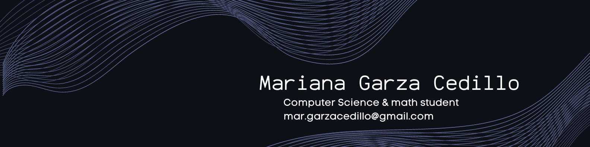

## Hi there 👋

🌟 CS & Math student | Software Dev | data science & quantum computing | Advocate for girls and women programmers' community

🚀 I'm deeply immersed in the world of STEM, bringing a unique blend of analytical thinking and problem-solving skills to my work due to my experience; all while applying my skills to real-world challenges.  

🎓 I’m a proud recipient of scholarships from NASA and Google, where I've had the opportunity to expand my knowledge in cutting-edge technologies.  

🤝 I believe in the power of collaboration and mentorship to drive meaningful change in the tech industry so let's connect and empower each other to shape a more diverse and inclusive future in tech!

[LinkedIn](https://www.linkedin.com/in/garza-cedillo/)  
[Portfolio](https://astrolemonmar.com/)  
[CV](https://drive.google.com/file/d/1tSZICEIfXdBELuO2p93mLzqfBGWxIR7s/view)

